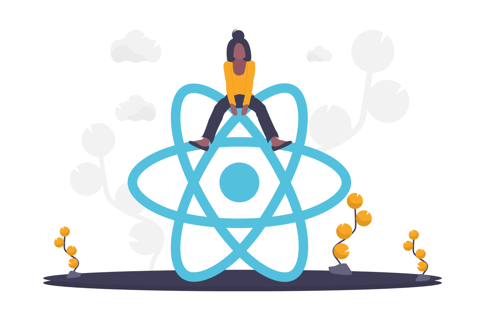

<!-- PROJECT SHIELDS -->

[![MIT License][license-shield]][license-url]

<!-- PROJECT LOGO -->

<p align="center">
  <span>
    
  </span>
  <h3 align="center">React Config</h3>
  <p align="center">
   A Reactjs project template from scratch
  </p>
</p>

<!-- ABOUT THE PROJECT -->

## About The Project

### Built With

This project is built with

- [Babel](https://babeljs.io/)
- [Reactjs](https://es.reactjs.org/)
- [Webpack](https://webpack.js.org/)
- [Docker](https://www.docker.com/)

<!-- GETTING STARTED -->

## Getting started

1. Installation

- Clone the repo

```
git clone https://github.com/fernancumez/react-config.git
```

2. cd into folder

```
cd react-config
```

3. Download dependencies

```
npm install
```

<!-- USAGE -->

## Usage

- Run `npm run build` for production mode
- Run `npm run start` for development mode

<!-- DOCKER -->

## With Docker

- `docker build` . -t react-config
- `docker run` -d -p 8080:80 --name myapp react-config

<!-- LICENSE -->

## License

Distributed under the MIT License. See `LICENSE` for more information.

<!-- CONTACT -->

## Contact

Fernando Cúmez - [@fernancumez](https://twitter.com/fernancumez) - fernancumez@gmail.com

Project Link: [https://github.com/fernancumez/react-config](https://github.com/fernancumez/react-config)

<!-- MARKDOWN LINKS & IMAGES -->
<!-- https://www.markdownguide.org/basic-syntax/#reference-style-links -->

[license-shield]: https://img.shields.io/github/license/othneildrew/Best-README-Template.svg?style=flat-square
[license-url]: https://github.com/fernancumez/react-config/blob/main/LICENSE
